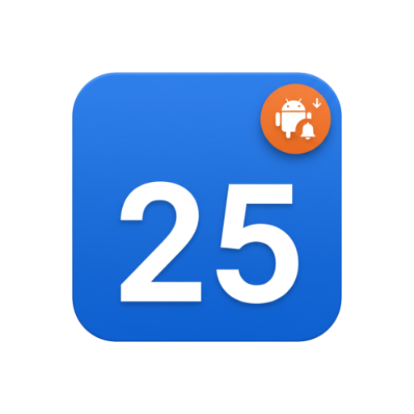
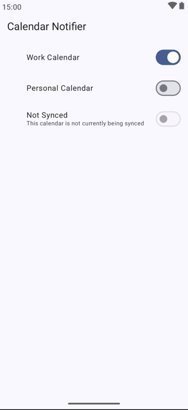

# Android Calendar Notify

The "Android Calendar Notify" app is designed to keep users informed about new and upcoming events across their synced calendars. Its primary function is to monitor device calendars and generate notifications for any *new, future* events that appear in user-selected calendars.

My wife and I recently changed from inviting each other to specific calendar events, to sharing our entire calendars (along with new ones for each of our children).  This has the unfortunate downside that her or myself don't really get the nice email notification when being added to a new calendar event -- I also needed a good test project to try out [Spec-Kit](https://github.com/github/spec-kit/).

**Core Notification System:**
*   The app periodically scans for calendar updates, checking every 15 minutes for new events.
*   It maintains a local record of "seen" calendar events to ensure only genuinely new events trigger notifications.
*   When a new, future event is detected in a monitored calendar, the app sends a notification to the user.
*   These notifications are informative, displaying the event's title, start time, start date, and the name of the calendar it belongs to. For all-day events, the notification will clearly indicate it's an all-day event.
*   To enhance user experience, clicking on a notification will directly launch the Google Calendar app, navigating to the specific event details.
*   Notifications will visually incorporate the color of the calendar the event belongs to.

**User Interface for Calendar Management:**
*   The application provides a clear interface listing all calendars synced to the device.
*   Each calendar entry in the UI displays its name and associated color.
*   Users have granular control, able to toggle monitoring on or off for each individual calendar. This ensures notifications are only received from desired sources.
*   Calendars that are not currently synced to the device are clearly marked, with their monitoring toggle disabled and a subtitle indicating their unsynced status.
*   For ease of navigation, the calendar list is sorted alphabetically, case-insensitive.

**Note:** This project was generated as an experiment using [Spec-Kit](https://github.com/github/spec-kit/). There is no human-created code in this repository; the entire codebase was generated by an AI.

The application launcher icon was created using Gemini Nano Banana.